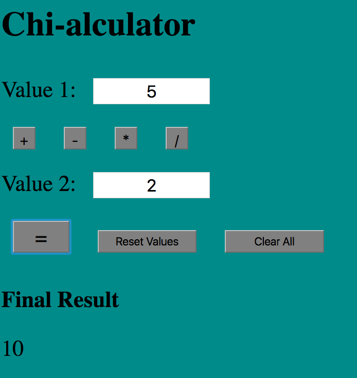

# Calculator Application

This weekend challenge introduces a server and the concept of storing logic on the server to create a calculator.

We started playing with AJAX, sending requests to the server and displaying results on the DOM.



## Getting Started

These instructions will get you a copy of the project up and running on your local machine for development and testing purposes.

### Prerequisites

You will need to have the following software installed.

[Node.js](https://nodejs.org/en/)

### Installing

Steps to get the development environment running.

1. Clone the repository to your local machine.

```
git clone https://github.com/BetsyRowley/weekendChallenge-2.git
```

2. Install all dependencies.

```
npm install
```

3. Spin up the Server.

```
npm start
```

4. Open in the browser.

```
localhost:8000
```

## Built With

* Express.js
* jQuery
* Node.js
* HTML5
* CSS3

## Authors

* [**Betsy Rowley**](https://github.com/BetsyRowley)

## Acknowledgments

* Prime Digital Academy Instructors Chris Black and Scott Bromander for their on-going support.
